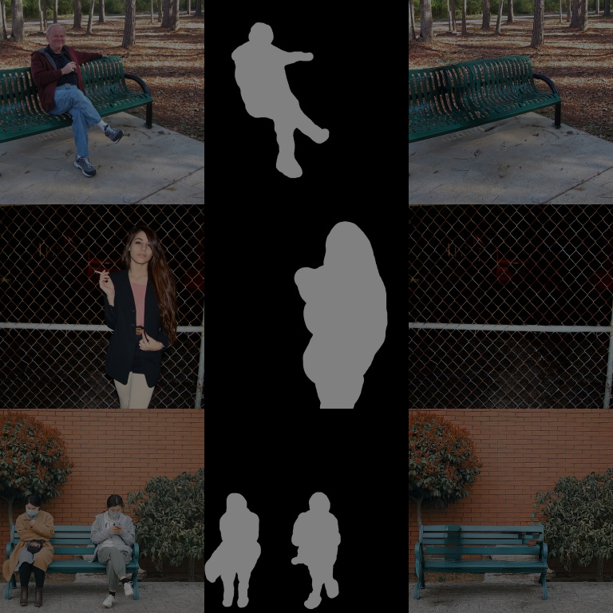
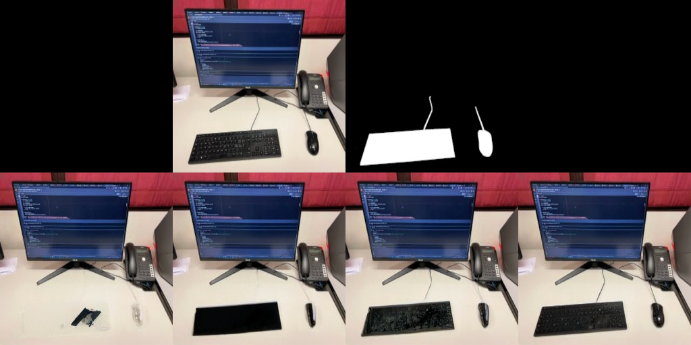

# Stable Diffusion for Inpainting without prompt conditioning

<p align="right">
<a href="https://pytorch.org/"></a>
<a href="https://github.com/lorenzo-stacchio/stable-diffusion_custom_inpaint"></a>
</p>

[Stable Diffusion](#stable-diffusion-v1) is a latent text-to-image diffusion
model.
Thanks to a generous compute donation from [Stability AI](https://stability.ai/) and support from [LAION](https://laion.ai/), the authors were able to train a Latent Diffusion Model on 512x512 images from a subset of the [LAION-5B](https://laion.ai/blog/laion-5b/) database. 

The authors trained these model for a variety of tasks, including the Inpainting.
In this project, I focused on providing a good codebase to easily fine-tune or training from scratch the Inpainting architecture for a target dataset.



# INITIAL DISCLAIMER
This repository is meant to be working only on certain simple use cases and gpus.ù
Use just what is specified in the following examples.


## Original paper
[**High-Resolution Image Synthesis with Latent Diffusion Models**](https://ommer-lab.com/research/latent-diffusion-models/)<br/>
[Robin Rombach](https://github.com/rromb)\*,
[Andreas Blattmann](https://github.com/ablattmann)\*,
[Dominik Lorenz](https://github.com/qp-qp)\,
[Patrick Esser](https://github.com/pesser),
[Björn Ommer](https://hci.iwr.uni-heidelberg.de/Staff/bommer)<br/>
_[CVPR '22 Oral](https://openaccess.thecvf.com/content/CVPR2022/html/Rombach_High-Resolution_Image_Synthesis_With_Latent_Diffusion_Models_CVPR_2022_paper.html) |
[GitHub](https://github.com/CompVis/latent-diffusion) | [arXiv](https://arxiv.org/abs/2112.10752) | [Project page](https://ommer-lab.com/research/latent-diffusion-models/)_


  
## Python environment

### Pip

Python `3.6.8` environment built with pip for `CUDA 10.1` and tested on a `Tesla V100` gpu (Centos 7 OS).

```
pip install -r requirements.txt
```

### Conda enviroment of the [original repo](https://github.com/CompVis/stable-diffusion#requirements)
A suitable [conda](https://conda.io/) environment named `ldm` can be created
and activated with:

```
conda env create -f environment.yaml
conda activate ldm
```

You can also update an existing [latent diffusion](https://github.com/CompVis/latent-diffusion) environment by running

```
conda install pytorch torchvision -c pytorch
pip install transformers==4.19.2 diffusers invisible-watermark
pip install -e .
``` 

## Inpainting with Stable Diffusion

In this project, I focused on the inpainting task, providing a good codebase to easily fine-tune or training the model from scratch.

### **Reference Sampling Script**

Here is provided a simple reference sampling script for inpainting.

For this use case, you should need to specify a ```path/to/input_folder/``` that contains image paired with their mask (e.g., image1.png - image1_mask.png) and a ```path/to/output_folder/``` where the generated images will be saved.

To have meaningful results, you should download inpainting weights provided by the authors as baseline with:

```
wget -O models/ldm/inpainting_big/model_compvis.ckpt https://ommer-lab.com/files/latent-diffusion/inpainting_big.zip
```

N.B. even if the file was provided as a zip file, it corresponds to [a checkpoint file saved with pytorch-lightning](https://github.com/CompVis/stable-diffusion/issues/17#issuecomment-1232756078).


Follows the script usage:

```commandline
usage: inpaint_runaway_correct.py [-h] --indir [INDIR] 
        --outdir [OUTDIR]
        --prefix PREFIX --ckpt CKPT --yaml_profile
        YAML_PROFILE [--steps STEPS] [--ema]

Stable Diffusion Inpainting

optional arguments:
  -h, --help            show this help message and exit
  --indir [INDIR]       dir containing image-mask pairs       
                        (`example.png` and `example_mask.png`)
  --outdir [OUTDIR]     dir to write results to
  --prefix PREFIX       path of weights to load
  --ckpt CKPT           path of weights to load
  --yaml_profile YAML_PROFILE
                        yaml file describing the model to initialize
  --steps STEPS         number of ddim sampling steps
  --ema                 use ema weights
```

Note: The inference config should not use EMA checkpoints (do not include `--ema`) if the model was trained on few images. That's because the model won't learn the needed stastistics to inpaint the target dataset.

In case the model was instead trained on a large and varied dataset such as ImageNet, you should use them to avoid influence too much the weights of the model with the last training epochs and so mantaining a regularity in the latent space and on the learned concepts.

#### **Usage example with original weights**

The following command will take all the images in the ```indir``` folder that has a "_mask" pair and generate the inpainted counterparts saving them in ```outdir``` with the model defined in ```yaml_profile``` loading the weights from the ```ckpt``` path. 
Each of the image filepaths will be prefixed with ```prefix```.
The ```device``` used in such sample is the first indexed gpu.


```
python scripts/inpaint_runaway_correct.py --indir "data/samples/inpainting_original_paper/" --outdir "data/samples/output_inpainting_original_paper/" --ckpt "models/ldm/inpainting_big/model_compvis.ckpt" --yaml_profile "configs/latent-diffusion/inpainting_runaway_inference.yaml" --device cuda:0 --prefix "sd_examples"
```


### **Reference Training Script**

This training script was put to good use to overfit stable diffusion, over the reconstruction of a single image (to test its generalization capabilities). 

In particular, the model aims at minimizing the perceptual loss to reconstruct a keyboard and a mouse in a classical office setting.

In this configuration, the universal autoencoder was frozen and was used to conditioning the network denoising process with the concatenation method. So the only section trained was the backbone diffusion model (i.e., the U-NET). 

#### **Create a custom dataset**

The definition of the DataLoader used to train the inpainting model is defined in ```ldm/data/inpainting.py``` and was derived by the author's [inference script](https://github.com/CompVis/stable-diffusion/blob/main/scripts/inpaint.py) and several other resources like [this](https://github.com/huggingface/diffusers/tree/main/examples/research_projects/dreambooth_inpaint).

Both the training and validation dataloader, expect a csv file with three columns:  `image_path`,`mask_path`,`partition`.

After that, you can create a custom configuration `*.yaml` file, and specify the paths under the data key (check the [default configuration](configs/latent-diffusion/inpainting_runaway_customTEMPLATE.yaml)). 

#### **Example of training in a small custom dataset**
```
python3 main_inpainting.py --train --name  custom_training --base  configs/latent-diffusion/inpainting_runaway_customTEMPLATE.yaml  --gpus 1,   --seed  42
```

#### **Custom training results**

Creating a dataset with just three images of office desks with masked keyboard and mouse, I obtained the following results from fine-tuning the entire network (first row input, second row learned reconstruction over 256 epochs):



## BibTeX

```
@misc{stacchio2023stableinpainting,
      title={Train Stable Diffusion for Inpainting}, 
      author={Lorenzo Stacchio},
      year={2023},
}
```